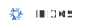
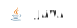

### Hello, I'm Bernardo Borges

 

## Tech for Fun and Free Time

 
   
  
  
  
  
   
   

 

## Work Setup

 
  
  
  
  
  
  
  
  
  
  
    
  
  
  
  
  
  
  
  

  

   

   

 

## Technologies I enjoyed working with

  
  
  
  
  
  
   
  

 

## Institutions, Departments and Companies I took part

- [Universidade Federal de Minas Gerais](https://ufmg.br/) - [Computer Science](https://dcc.ufmg.br/bacharelado-em-ciencia-da-computacao/) 
- [iJunior - Junior Enterprise](https://ijunior.com.br/) - Full Stack developer and Business Director 
- [Laboratório de Teoria da Computação](https://trex.dcc.ufmg.br/en/) - Formal Methods and Theorem Proving 
