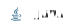

### Hello, I'm Bernardo Borges

[![Outlook](https://img.shields.io/badge/Outlook-0078D4?style=for-the-badge&logo=data:image/svg%2bxml;base64,PHN2ZyByb2xlPSJpbWciIHZpZXdCb3g9IjAgMCAyNCAyNCIgeG1sbnM9Imh0dHA6Ly93d3cudzMub3JnLzIwMDAvc3ZnIj48dGl0bGU+TWljcm9zb2Z0IE91dGxvb2s8L3RpdGxlPjxwYXRoIGQ9Ik03Ljg4IDEyLjA0cTAgLjQ1LS4xMS44Ny0uMS40MS0uMzMuNzQtLjIyLjMzLS41OC41Mi0uMzcuMi0uODcuMnQtLjg1LS4ycS0uMzUtLjIxLS41Ny0uNTUtLjIyLS4zMy0uMzMtLjc1LS4xLS40Mi0uMS0uODZ0LjEtLjg3cS4xLS40My4zNC0uNzYuMjItLjM0LjU5LS41NC4zNi0uMi44Ny0uMnQuODYuMnEuMzUuMjEuNTcuNTUuMjIuMzQuMzEuNzcuMS40My4xLjg4ek0yNCAxMnY5LjM4cTAgLjQ2LS4zMy44LS4zMy4zMi0uOC4zMkg3LjEzcS0uNDYgMC0uOC0uMzMtLjMyLS4zMy0uMzItLjhWMThIMXEtLjQxIDAtLjctLjMtLjMtLjI5LS4zLS43VjdxMC0uNDEuMy0uN1EuNTggNiAxIDZoNi41VjIuNTVxMC0uNDQuMy0uNzUuMy0uMy43NS0uM2gxMi45cS40NCAwIC43NS4zLjMuMy4zLjc1VjEwLjg1bDEuMjQuNzJoLjAxcS4xLjA3LjE4LjE4LjA3LjEyLjA3LjI1em0tNi04LjI1djNoM3YtM3ptMCA0LjV2M2gzdi0zem0wIDQuNXYxLjgzbDMuMDUtMS44M3ptLTUuMjUtOXYzaDMuNzV2LTN6bTAgNC41djNoMy43NXYtM3ptMCA0LjV2Mi4wM2wyLjQxIDEuNSAxLjM0LS44di0yLjczek05IDMuNzVWNmgybC4xMy4wMS4xMi4wNHYtMi4zek01Ljk4IDE1Ljk4cS45IDAgMS42LS4zLjctLjMyIDEuMTktLjg2LjQ4LS41NS43My0xLjI4LjI1LS43NC4yNS0xLjYxIDAtLjgzLS4yNS0xLjU1LS4yNC0uNzEtLjcxLTEuMjR0LTEuMTUtLjgzcS0uNjgtLjMtMS41NS0uMy0uOTIgMC0xLjY0LjMtLjcxLjMtMS4yLjg1LS41LjU0LS43NSAxLjMtLjI1Ljc0LS4yNSAxLjYzIDAgLjg1LjI2IDEuNTYuMjYuNzIuNzQgMS4yMy40OC41MiAxLjE3LjgxLjY5LjMgMS41Ni4zek03LjUgMjFoMTIuMzlMMTIgMTYuMDhWMTdxMCAuNDEtLjMuNy0uMjkuMy0uNy4zSDcuNXptMTUtLjEzdi03LjI0bC01LjkgMy41NFoiIGZpbGw9IndoaXRlIi8+PC9zdmc+Cg==)](mailto:bernborgess@outlook.com)
 

## Setup and Tech currently

 
   
   
  

  
  
  
   
  
  
  
  
  
  
    
  
  
  
  
  

  

  
  

  

     
   

 

## Technologies I enjoyed working with

 
<!-- https://img.shields.io/badge/Duolingo-FFF?style=for-the-badge&logo=duolingo&logoColor=58CC02 -->
   
   
  
  
  
  
  
  

   
  

  

 

## Institutions, Departments and Companies I took part 
- [Universidade Federal de Minas Gerais](https://ufmg.br/) - [Computer Science](https://dcc.ufmg.br/bacharelado-em-ciencia-da-computacao/) 
- [iJunior - Junior Enterprise](https://ijunior.com.br/) - Full Stack developer and Business Director 
- [Laboratório de Teoria da Computação](https://trex.dcc.ufmg.br/en/) - Formal Methods and Theorem Proving 

